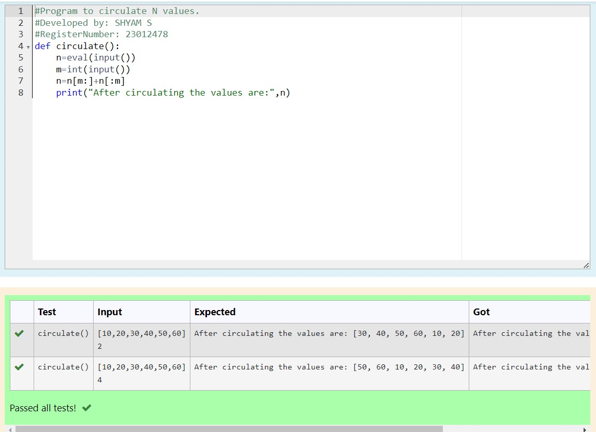

# Circulate-the-values-of-N-variables
## Aim:
To write a python program to circulate the n variables using function concept
## Equipment’s required:
PC
Anaconda - Python 3.7
## Algorithm: 
### Step 1:
Get the two values from the user
### Step 2: 
In circular swapping, the value of the first variable is assigned to the second variable
### Step 3: 
Get the value from the user for the number of rotation
### Step 4: 
Using the slicing concept rotate the list
### Step 5:
Print both the values it would be circulated
### Step 6: 
End the program
## Program:
```
# Program to circulate N values.
# Developed by: SHYAM S
# RegisterNumber: 23012478
def circulate():
    n=eval(input())
    m=int(input())
    n=n[m:]+n[:m]
    print("After circulating the values are:",n)
```    
## Output:


## Result:
Thus the circulating the values of N variables are successfully executed
